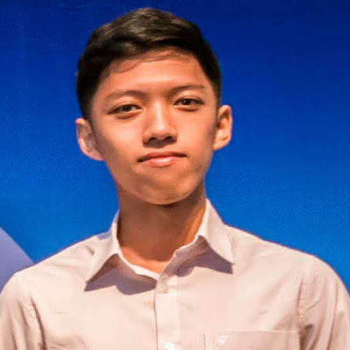

 I'm Phuc.
 

Currently I'm a Ph.D student at the [ML-Labs](https://ml-labs.ie/) cohort, based in Dublin City University, Ireland, under the supervison of Professor [Alan Smeaton](https://www.computing.dcu.ie/~asmeaton/index.html) and Dr. [Graham Healy](https://www.computing.dcu.ie/~ghealy/).

I have interest from theoretical to practical aspects of building intelligent system, with focus on Representation Learning, Unsupervised / Self-supervised Learning and Differentiable Computing.

# Research 

 of my research, see: [Google Scholar](https://scholar.google.com/citations?user=vkQF1egAAAAJ), [Semantic Scholar](https://www.semanticscholar.org/author/Phuc-H.-Le-Khac/1994194269), [ORCID iD](https://orcid.org/0000-0002-0504-5844).

### Contrastive Representation Learning: A Framework and Review

Journal article published in _IEEE Access_.
Link: [arXiv](https://arxiv.org/abs/2010.05113), [IEEE](https://ieeexplore.ieee.org/document/9226466).
Invited talk: [HackML meetup](https://www.youtube.com/watch?v=lFWJB1ig0e0).

# Projects

I enjoy developing and contributing to Open Source Software in my free time. Belows are some of my major open-source projects, for more detail check out my [Github](https://github.com/lkhphuc):

- [**Lightning-hydra-template**](https://github.com/lkhphuc/lightning-hydra-template): A template for small-scale research-oriented deep learning project using Pytorch Lightning, Hydra and Tensorboard.
- [**Pytorch-3D-Point-Cloud-Generation**](https://github.com/lkhphuc/pytorch-3d-point-cloud-generation): A popular port to Pytorch of “Learning Efficient Point Cloud Generation for Dense 3D Object Reconstruction”.
- [**Anomaly-XRay-GANs**](https://github.com/lkhphuc/Anomaly-XRay-GANs): An early attempt at combing GAN and Autoencoder for anomaly detection in Xray images.
- [**D2L-VN**](https://github.com/aivivn/d2l-vn): I am a Collaborators and help translate [Dive Into Deep Learning](https://www.d2l.ai/) book to Vietnamese.
- [**Machine Learning Yearning Vietnamese Translation**](https://github.com/aivivn/Machine-Learning-Yearning-Vietnamese-Translation): I am a contributor and help translate [Machine Learning Yearning](https://www.deeplearning.ai/machine-learning-yearning/) book to Vietnamese.
- [**Slack Visual Summary**](https://lkhphuc.com/slack-visual-summary/): A proof of concept demo to visually summarize a Slack channel using Machine Learning.

# Service
- Reviewer for: ICLR 2022, NeurIPS 2022
- **Content editor for [SigMM.org](http://sigmm.org)** (2019-now)

# Professional Acknowledgments
I have treasured over the years some unsolicited comments, feedbacks and good wishes from people that I deeply admired and respected. 
I decided to publish it here as some sort of "recommendation" or "testimonial", and also to remind myself more often.

Thank you all very much, you helped me to be who I am today and will continue to influence who I will become in the future.







